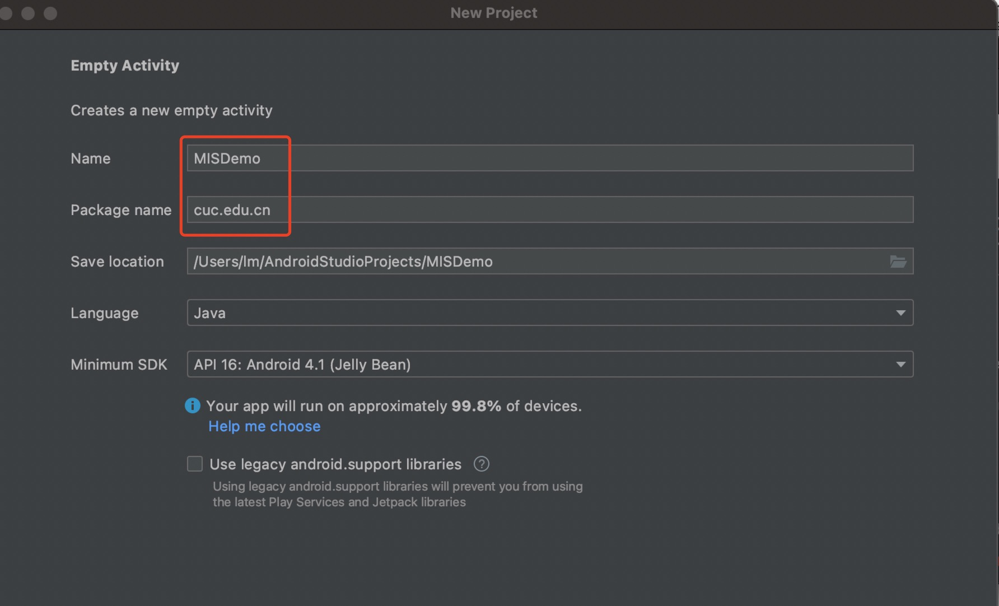
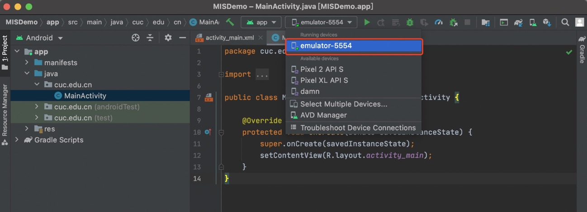
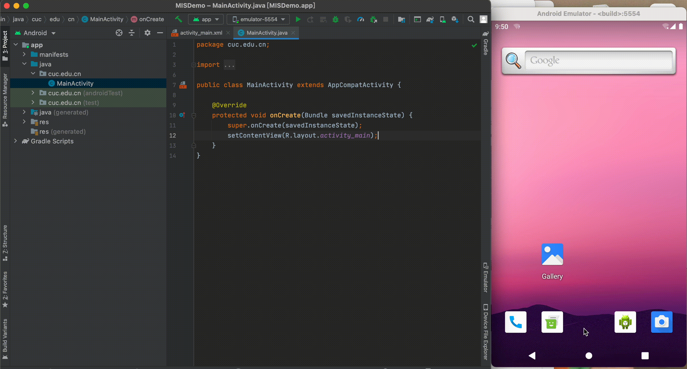
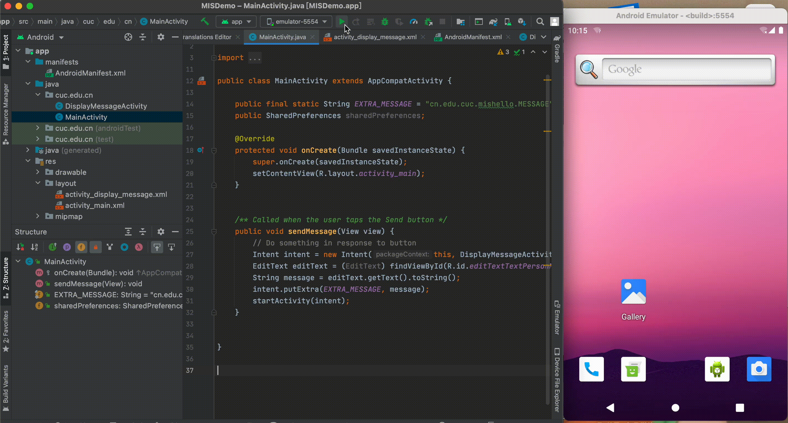
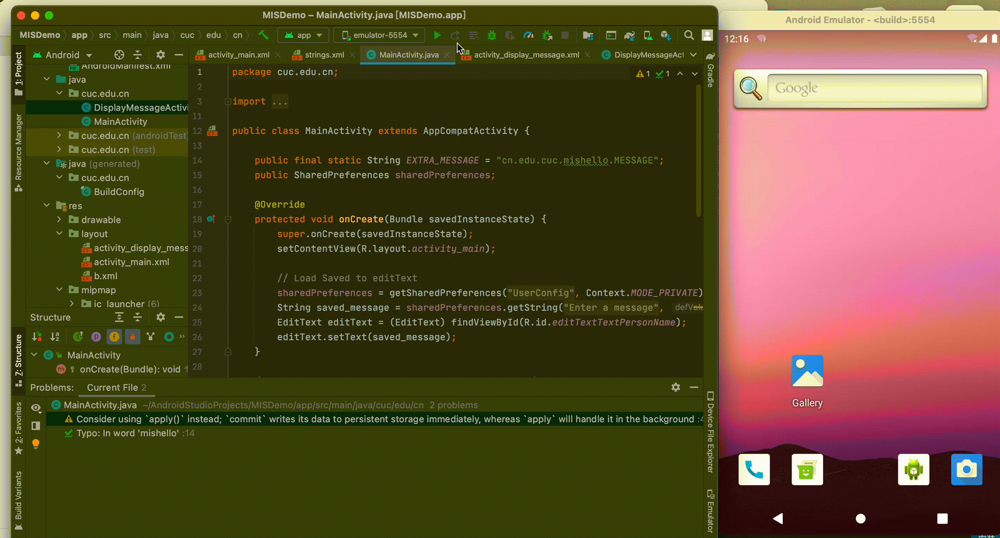
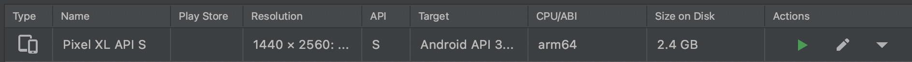
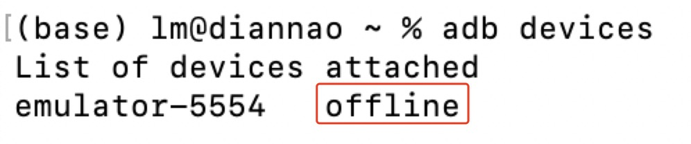
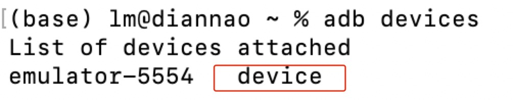

# ADB安全

### 实验过程

####  Hello World v1

[项目代码](code/Hello World v1)

根据Android官方给出的[指南](https://developer.android.google.cn/training/basics/firstapp/creating-project.html)一步一步创建并运行一个应用

+ 安装最新版 [Android Studio](https://developer.android.google.cn/studio/)

+ 在首页面点击` Create New Project`创建一个新项目

  

+ 在模拟器中试运行一个会显示“Hello, World!”的 Android 应用

  在工具栏中，从目标设备下拉菜单中，选择要用来运行应用的 AVD

  

  点击运行

  

+ 根据需求调整页面内容布局

  

+ 启动另一个activity（详细步骤参考[官方文档指南](https://developer.android.google.cn/training/basics/firstapp/starting-activity)）

  在已创建一个包含文本字段和Send按钮的应用后，向`MainActivity` 添加一些代码，以便在用户点按 **Send**按钮时启动一个显示消息的新 activity

  + 响应“Send”按钮

  + 创建一个intent

  + 创建第二个activity

  + 添加文本视图

  + 显示消息

  + 添加向上导航功能

  + 运行应用

    

#### Hello World v2

根据[课本提供代码](https://c4pr1c3.github.io/cuc-mis/chap0x06/exp.html)在原项目中进行替换，该代码能实现的功能是：

- 使用SharedPreferences持久化存储小数据并按需读取
- 实现一个简单的注册码校验功能
  - 输入正确注册码时跳转至新的activity并显示“注册成功”
  - 输入错误注册码时跳转至新的activity并显示“注册失败”

运行效果



### 思考题

- DisplayMessageActivity.java中的2行打印日志语句是否有风险？如果有风险，请给出漏洞利用示范。如果没有风险，请给出理由。

  有风险，在我们对应用进行调试或运行时，Logcat会直接打印出用户输入和正确的注册码

  

- SharedPreferences类在进行读写操作时设置的`Context.MODE_PRIVATE`参数有何作用和意义？还有其他可选参数取值吗？

  SharedPreferences()有四种操作模式:

  ```
  Context.MODE_PRIVATE
  Context.MODE_APPEND
  Context.MODE_WORLD_READABLE
  Context.MODE_WORLD_WRITEABLE
  ```

  其意义分别为：

  1. Context.MODE_PRIVATE：为默认操作模式,代表该文件是私有数据,只能被应用本身访问,在该模式下,写入的内容会覆盖原文件的内容
  2. Context.MODE_APPEND：模式会检查文件是否存在,存在就往文件追加内容,否则就创建新文件
  3. Context.MODE_WORLD_READABLE：表示当前文件可以被其他应用读取
  4. Context.MODE_WORLD_WRITEABLE：表示当前文件可以被其他应用写入

### 实验问题

+ **问题描述**：在使用AVD Manager内创建的模拟器时，模拟器一直处于离线状态（由于我的电脑是m1芯片，只能下载ABI为arm64的模拟器镜像）

  

  

  **解决过程**：

  + 看到有[博客](https://blog.csdn.net/qq_36252342/article/details/80908414)说尝试开一下模拟器的USB调试模式，于是按照[官方文档](https://developer.android.google.cn/training/basics/firstapp/running-app)中所描述的真机启用USB调试过程，在模拟器中执行了一下，但是点按版本号七次后并没有出现开发者选项，而是进入了如下界面

    

    由于该镜像版本是最新版本的Androids 12，在网上没查到该版本启用USB调试功能的方法，只知道如上界面是一个彩蛋。。。🥺

  + 于是索性不用AVD Manager里的模拟器了，下载[谷歌出品](https://github.com/google/android-emulator-m1-preview)的android-emulator-m1-preview外置模拟器，十分顺利地打开并连接上了～

    

### 实验参考

+ [课本](https://c4pr1c3.github.io/cuc-mis/chap0x06/exp.html)
+ [DVAHW](https://github.com/c4pr1c3/DVAHW)
+ [Run your app](https://developer.android.google.cn/training/basics/firstapp/running-app)
+ [android中xmlns:tools属性详解](https://blog.csdn.net/u012256258/article/details/50730180)
+ [android studio打印日志语句Log.d()](https://blog.csdn.net/weixin_42950079/article/details/83544064)
+ [SharedPreferences四种操作模式使用详解](https://www.jb51.net/article/119368.htm)
+ [Mac M1中android-emulator-m1-preview的安装](https://blog.csdn.net/weixin_44058725/article/details/116452534)


