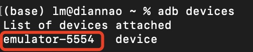
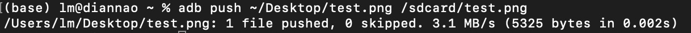
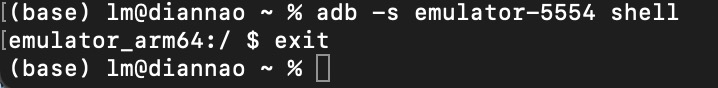
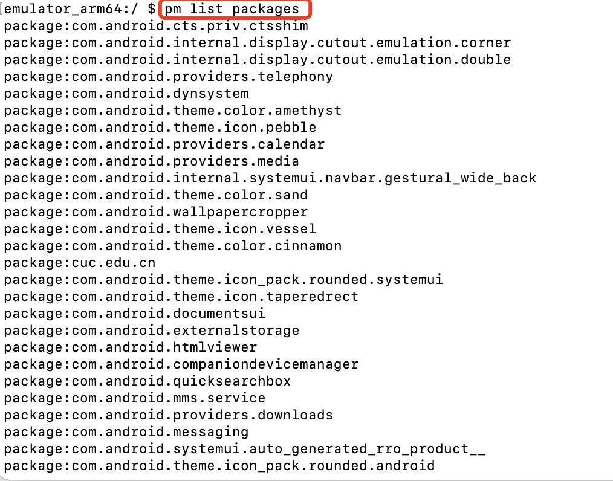
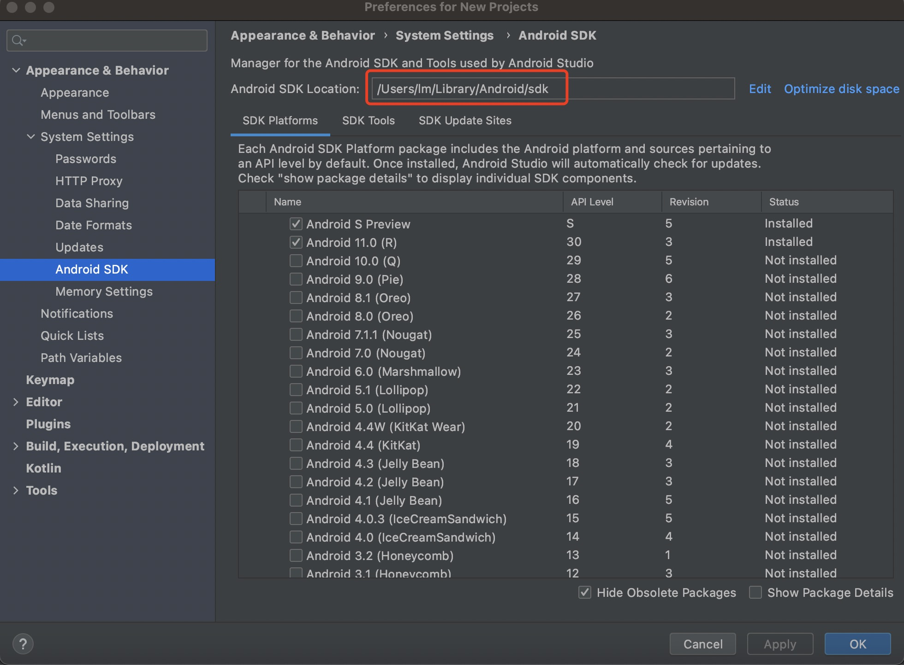
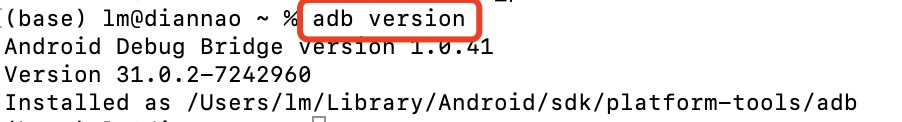

# ADB实验

### 实验过程

以下命令的详细信息均可见[官方文档](https://developer.android.google.cn/studio/command-line/adb)

**adb基本命令**

+ 查询设备`adb devices`

  

+ 将命令发送至特定设备`adb -s emulator-xxxx [command]   `

+ 安装应用`adb install path_to_apk`

+ 设备与本机文件复制

  + 将文件复制到设备

    `adb pull remote local`

  + 从设备复制文件

    `adb push local remote`

    

+ 发出shell命令

  + 发出单个命令

    `adb [-d |-e | -s serial_number] shell shell_command`

  + 在设备上启动交互式 shell

    `adb [-d | -e | -s serial_number] shell`

    


**Activity Manager (am)**

```bash
# Camera（照相机）的启动方法为:
am start -n com.android.camera/com.android.camera.Camera

# Browser（浏览器）的启动方法为：
am start -n com.android.browser/com.android.browser.BrowserActivity

# 启动浏览器 :
am start -a android.intent.action.VIEW -d  http://sec.cuc.edu.cn/

# 拨打电话 :
am start -a android.intent.action.CALL -d tel:10086

# 发短信：
adb shell am start -a android.intent.action.SENDTO -d sms:10086 --es sms_body ye --ez exit_on_sent true
```

在命令行中启动浏览器示例：


=======


**软件包管理器（pm）**

在 adb shell 中，可以使用软件包管理器 (`pm`) 工具发出命令，以对设备上安装的应用软件包执行操作和查询。在 shell 中，相应的语法为：

`pm command`

也可以直接从 adb 发出软件包管理器命令，无需进入远程 shell。例如：

`adb shell pm uninstall com.example.MyApp`

示例：

输出所有软件包`list packages`




### 实验问题

+ adb:command not found

  解决：需要在终端配置一下环境变量

  + 在Android Studio的SDK Manager中查看sdk路径

    

  + 配置环境变量

    ```
    #进入当前用户home目录
    echo $HOME
    
    #创建.bash_profile文件
    touch .bash_profile
    
    #打开.bash_profile文件
    open -e .bash_profile
    
    #在打开的文件中编辑如下：
    export PATH=${PATH}:/Users/lm/Library/Android/sdk/tools:/Users/lm/Library/Android/sdk/platform-tools
    
    #执行命令
    source .bash_profile
    ```

  + 输入命令`adb version`查看是否配置成功

    


### 实验参考

+ [课本](https://c4pr1c3.github.io/cuc-mis/chap0x06/exp.html)
+ [Android Emulator M1 Preview](https://github.com/google/android-emulator-m1-preview)
+ [Mac M1中android-emulator-m1-preview的安装](https://blog.csdn.net/weixin_44058725/article/details/116452534)

+ [Mac下配置adb命令环境变量](https://blog.csdn.net/ancientear/article/details/81214533)
+ [Android 调试桥 (adb)](https://developer.android.google.cn/studio/command-line/adb)


