# 第五章实验—— Android模拟器环境搭建

## 实验内容

- [x] 安装和配置Java SDK

- [x] 安装Android Studio

+ [x] 下载安装Android SDK

+ [x] 配置Android模拟器运行环境

+ [x] 配置Gradle编译环境

  

## 实验环境

- Windows10

  

## 实验步骤

#### 安装和配置Java SDK

+ 在[官网](https://www.oracle.com/java/technologies/javase-jdk11-downloads.html)找到对应版本的JDK下载

  

+ 根据提示安装

  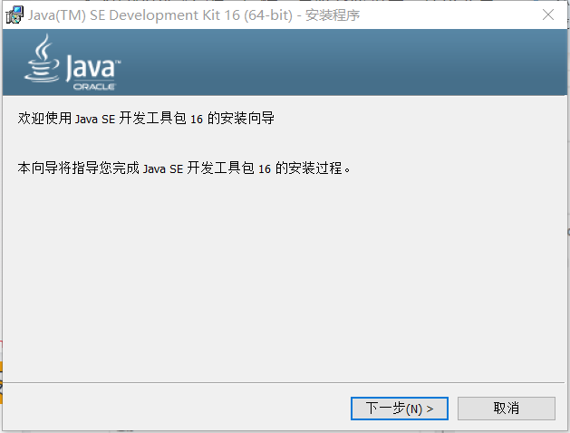

+ 配置环境变量

  “我的电脑”右键→属性→高级系统设置→环境变量

  + 新建系统变量`JAVA_HOME`，值为JDK安装根目录

    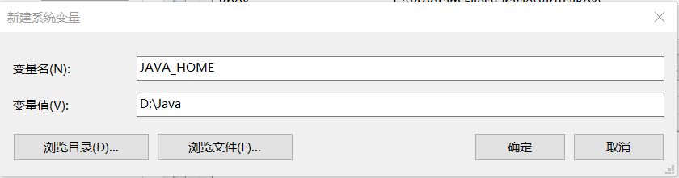

  + 编辑`PATH`变量，将新建的JAVA_HOME变量加上bin目录添加到PATH中

    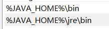

+ 终端中验证Java SDK安装完成

  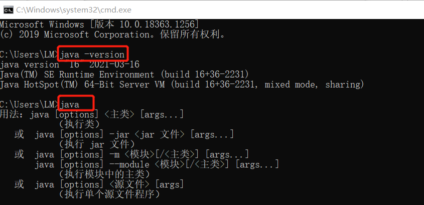

#### 安装Android Studio

通过官方网站下载[Android Studio](https://developer.android.com/studio/) 最新版本并根据提示安装

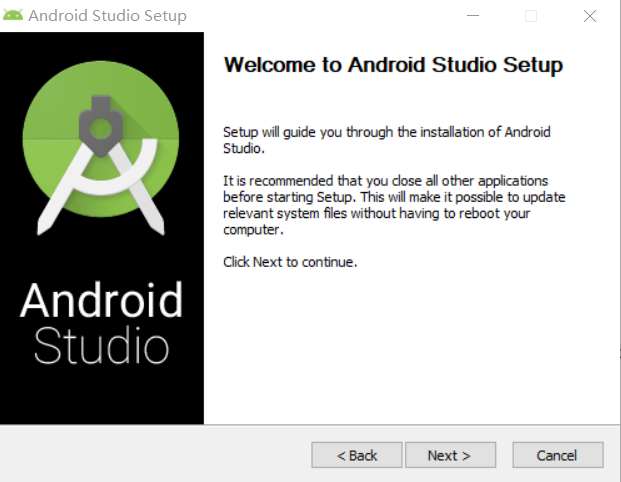

#### 下载安装Android SDK

  启动 Android Studio 之后进入菜单选项 Configure -> SDK Manager，默认安装11.0版本的Android SDK

  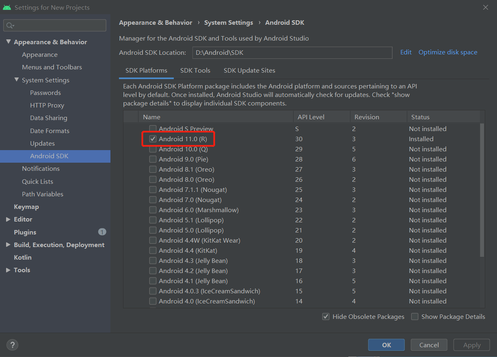

#### 配置Android模拟器运行环境

在SDK tool界面勾选Intel x86 Emulator Accelerator (HAXM installer)一项

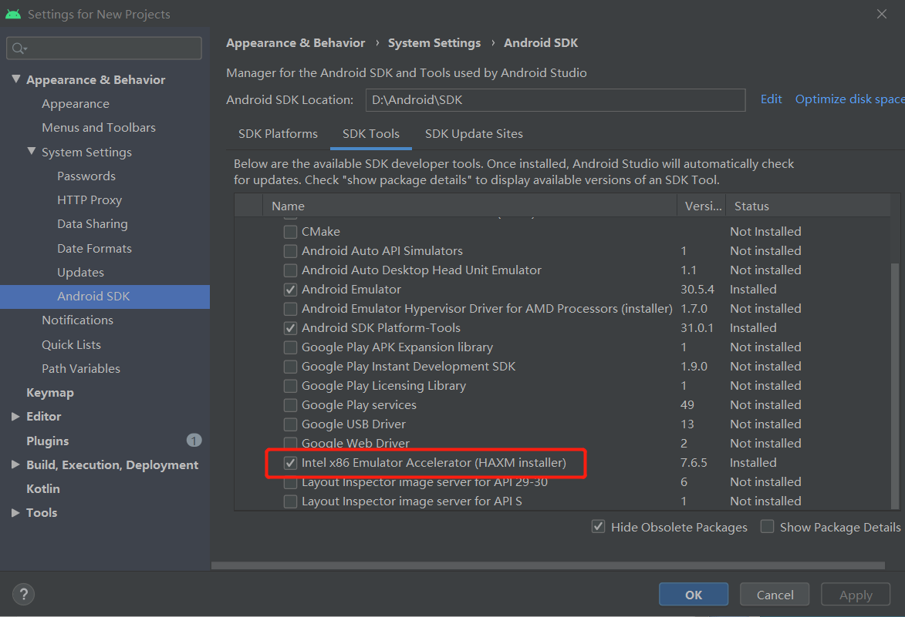

#### 配置Gradle编译环境

新建一个Test项目

+ 在菜单`File`——`Project Structure`下查看gradle 版本和 Android Studio Gradle 插件版本信息

  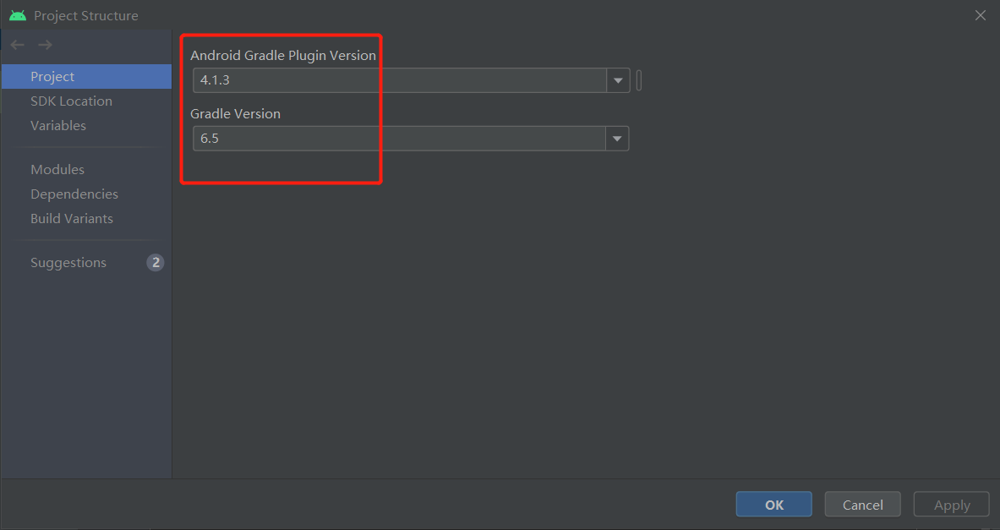

+ 在`setting`——`gradle`下配置gradle

  其中第一项是选择使用 Android Studio 的内置 gradle ，第二项是使用自己安装的 gradle

  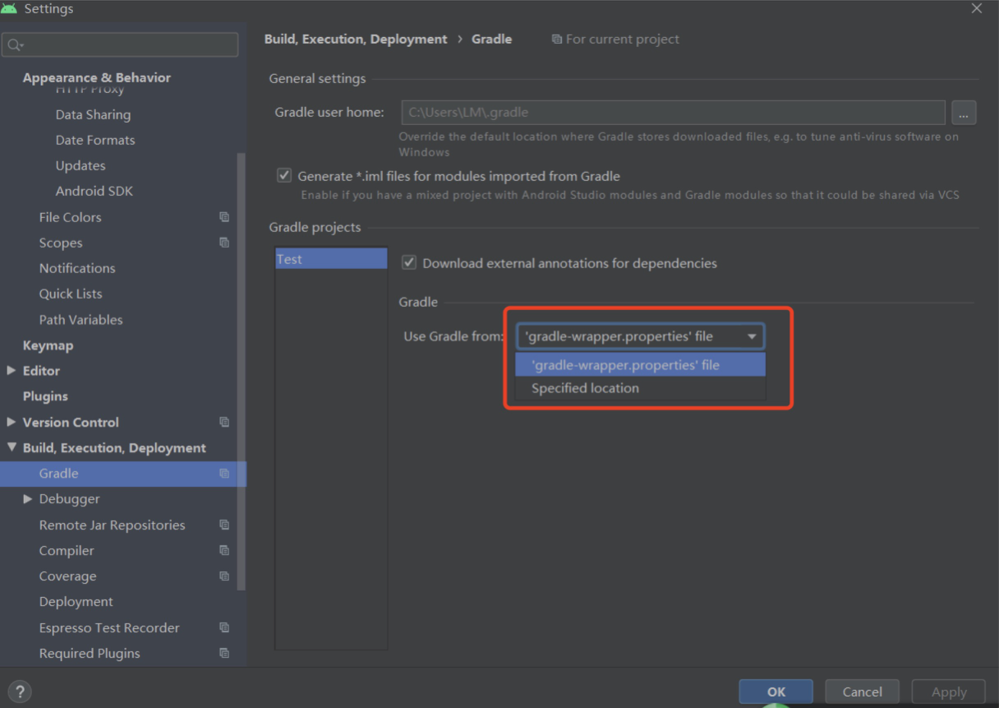

#### 运行测试项目

运行一下测试项目

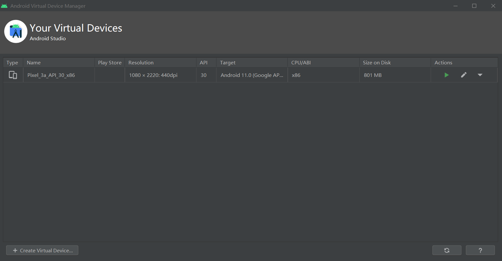

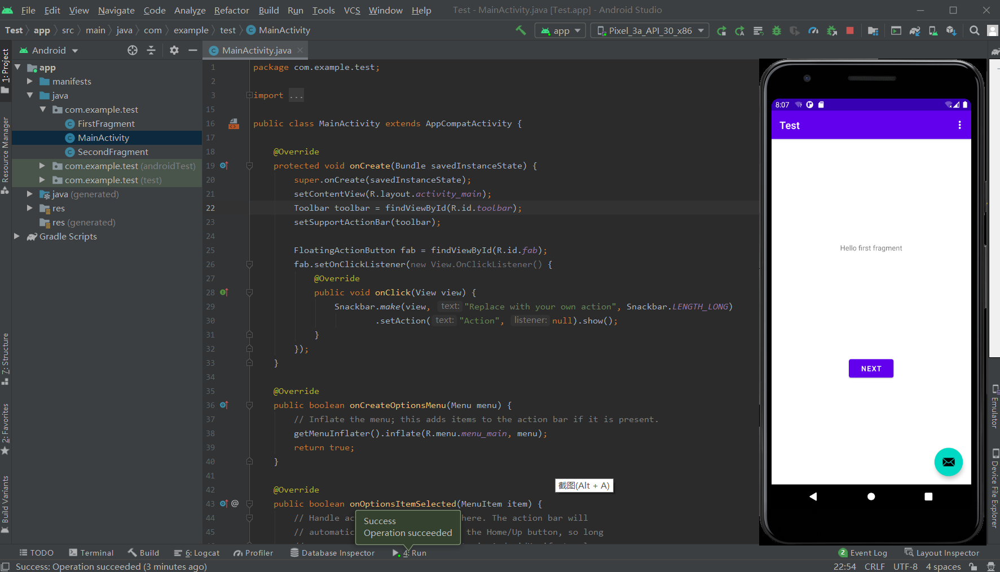

## 实验参考

+ [移动互联网安全课本](https://c4pr1c3.github.io/cuc-mis/chap0x05/exp.html)
+ [Android Studio安装配置详细步骤](https://blog.csdn.net/weixin_43883917/article/details/108942788)

+ [JDK的下载、安装和环境配置教程](https://blog.csdn.net/Marvin_996_ICU/article/details/106240065)

