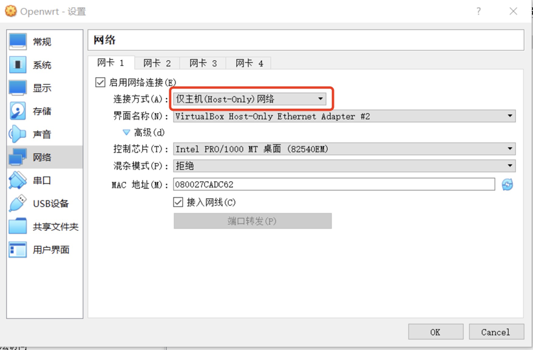

# 第一章实验—— OpenWrt 虚拟机搭建
## 实验目的

- 熟悉基于 OpenWrt 的无线接入点（AP）配置
- 为第二章、第三章和第四章实验准备好「无线软 AP」环境


## 实验环境

- VirtualBox

- 可以开启监听模式、AP 模式和数据帧注入功能的 USB 无线网卡,`Netgear WNA1100`

  

## 实验要求

- [x] 对照 [第一章 实验](https://c4pr1c3.github.io/cuc-mis/chap0x01/exp.html) `无线路由器/无线接入点（AP）配置` 列的功能清单，找到在 OpenWrt 中的配置界面并截图证明；

- [x] 记录环境搭建步骤；

- [x] 如果 USB 无线网卡能在 `OpenWrt` 中正常工作，则截图证明；

- [x] 如果 USB 无线网卡不能在 `OpenWrt` 中正常工作，截图并分析可能的故障原因并给出可能的解决方法


## 实验内容

#### 安装Openwrt虚拟机

+ 在[官网](https://downloads.openwrt.org/releases/19.07.5/targets/x86/64/openwrt-19.07.5-x86-64-combined-squashfs.img.gz)下载对应版本的虚拟机镜像

+ img 格式转换为 Virtualbox 虚拟硬盘格式 vdi

  ```
  dd dd if=openwrt-x86-64-combined-squashfs.img of=openWrt.img bs=128000 conv=sync
  VBoxManage convertfromraw --format VDI openwrt-x86-64-combined-squashfs.img openwrt-x86-64-combined-squashfs.vdi
  ```

+ 新建虚拟机选择「类型」 Linux / 「版本」Linux 2.6 / 3.x / 4.x (64-bit)，填写虚拟机名称`Openwrt`

+ 内存设置为 256 MB

+ 使用已有的虚拟硬盘文件 - 「注册」新虚拟硬盘文件选择刚才转换生成的 `openwrt-x86-64-combined-squashfs.vdi`文件

  

#### VirtualBox 设置

+ 虚拟网卡设置

  - 第一块网卡设置为：Intel PRO/1000 MT 桌面（仅主机(Host-Only)网络）
  - 第二块网卡设置为：Intel PRO/1000 MT 桌面（网络地址转换(NAT)）

  

  第一块网卡对应的 `Host-Only` 网卡设置如下：

  

+ USB设备配置

  

+ 磁盘类型改为多重加载

  

#### 虚拟机Openwrt设置

+ 配置网络`vim /etc/config/network`

  ```
  config interface 'lan'
      option type 'bridge'
      option ifname 'eth0'
      option proto 'static'
      option ipaddr '192.168.56.55' 
      option netmask '255.255.255.0'
      option ip6assign '60'
  ```

  `ifdown eth0 && ifup eth0`完成指定网卡 `eth0` 的重新加载配置

  

+ 安装LuCi进行网页端的远程管理

  `opkg update && opkg install luci`

  安装好后在浏览器通过ip地址访问OpenWrt

  

#### 开启AP功能

+ 安装软件包

  ```
  # 在OpenWrt中使用lsusb方式查看USB无线网卡的芯片信息
  opkg update && opkg install usbutils 
  
  # 让OpenWrt支持WPA系列更安全的无线安全机制
  opkg install hostapd wpa-supplicant
  ```

  

+ 在虚拟机的USB设备管理中，将网卡注册到设备列表内

  

+ 在OpenWrt中查看网卡设备及其驱动

  ```
  # 查看 USB 外设的标识信息
  lsusb 
  
  # 查看 USB 外设的驱动加载情况
  lsusb-t
  ```

  可以看到USB类型为`Netgear WNA1100`,	虚拟机中已成功加载其驱动`ath9k_htc`

  

+ 无线网卡及其驱动配置好后，登入LuCi即可在顶部菜单`Network`处发现`Wireless`项

+ 为了使其他无线客户端可以正确发现新创建的无线网络，进行 以下3 项特殊配置

  + 无线网络的详细配置界面里的 `Interface Configuration` 表单里 `Network` 勾选 `wan` 

    

  + 虚拟机的 WAN 网卡对应的虚拟网络类型必须设置为 `NAT` 而不能使用 `NatNetwork`，无线客户端连入无线网络后才可以正常上网。

  + 手工指定信道选择和信号强度

    

+ 无线网卡编辑完成后启用网卡

  在没有客户端加入当前无线网络时，无线网络状态如下图所示：

  

  在有客户端加入当前无线网络时，无线网络状态如下图所示：

  

  

  

#### 无线路由器/无线接入点（AP）功能清单配置界面自查

- 重置和恢复AP到出厂默认设置状态

  

- 设置AP的管理员用户名和密码

  

  

- 设置SSID广播和非广播模式

  

- 配置不同的加密方式

  

- 设置AP管理密码

  

- 配置无线路由器使用自定义的DNS解析服务器 

  

- 配置DHCP和禁用DHCP

  

- 开启路由器/AP的日志记录功能（对指定事件记录）

  

- 配置AP隔离(WLAN划分)功能

  

  

- 设置MAC地址过滤规则（ACL地址过滤器）

  

- 查看WPS功能的支持情况

  **WPS（Wi-Fi Protected Setup，WiFi保护设置），是由WiFi联盟组织实施的认证项目，其主要目的是用来简化无线网络的安全加密配置。WPS技术用来协助用户自动设置网络名（SSID）、配置最高级别的WPA2安全密钥**

  根据此[网页](https://forum.openwrt.org/t/wps-on-off-in-luci/1046)中所提示的，在LuCi页面的`Network>Wireless>Wireless Security`下没有直接找到WPS功能开启处诶。。。

- 查看AP/无线路由器支持哪些工作模式

  

## 实验问题

+ 使用VBoxManage转换镜像格式时报错，`VBoxManage: error: VD: The given disk size 19444018 is not aligned on a sector boundary (512 bytes)`，

  + 解决方法：根据[官网](https://openwrt.org/zh/docs/guide-user/virtualization/virtualbox-vm)的提示,使用语句`dd if=openwrt-x86-64-combined-squashfs.img of=openWrt.img bs=128000 conv=sync`整合镜像，再次进行转换

+ 关于虚拟机识别网卡的一点插曲

  问题：插入无线网卡后在本机和虚拟机均无法识别到该网卡

  解决步骤：

  + 在本机查看该设备，发现本机驱动程序无法使用（以为这是问题所在）

    

  + 通过其他能识别该设备的电脑获取设备信息后，在网络上搜索`Netgear WNA1100`,发现[NETGEAR官网](https://www.netgear.com/support/download/?model=WNA1100)提供了驱动，按照提示下载驱动，本机能够识别该USB设备了

  + 准备再次打开虚拟机进行尝试时，在虚拟机的USB设备管理界面，突然想起来老师操作时有一步是将网卡注册到设备列表内（这样每次插入网卡都能使USB设备首先被虚拟机识别到），注册好后打开虚拟机发现网卡已经能够被识别

  + 后来想了一下，USB设备在虚拟机中能否识别好像和本机能否识别驱动没什么关系吧？于是通过控制变量法测试了一下，发现在删除本机驱动、保留虚拟机USB设备列表内的网卡信息时，网卡仍能被虚拟机识别到，所以问题所在是USB设备筛选器

    

    

## 参考

+ [在Virtualbox虚拟机中运行OpenWrt](https://openwrt.org/zh/docs/guide-user/virtualization/virtualbox-vm)

+ [WPS ON/OFF in LuCI?](https://forum.openwrt.org/t/wps-on-off-in-luci/1046)

+ [NETGEAR](https://www.netgear.com/support/download/?model=WNA1100)