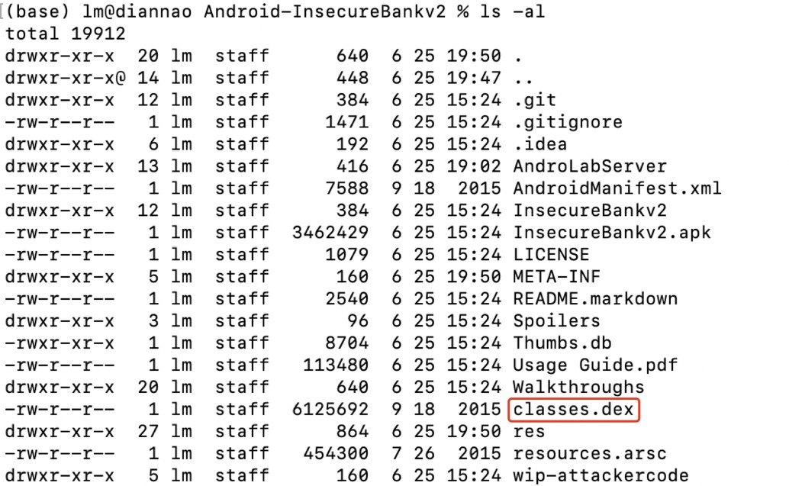

# 第八章——Android 缺陷应用漏洞攻击实验

## 实验目的

- 理解 Android 经典的组件安全和数据安全相关代码缺陷原理和漏洞利用方法；
- 掌握 Android 模拟器运行环境搭建和 `ADB` 使用；

## 实验环境

+ Android模拟器[android-emulator-m1-preview](https://github.com/google/android-emulator-m1-preview)
+ 主机：macOS Big Sur 11.1

- [Android-InsecureBankv2](https://github.com/c4pr1c3/Android-InsecureBankv2)

## 实验要求

- [x] 详细记录实验环境搭建过程；

- [x] 至少完成以下实验：
  - Developer Backdoor
  - Insecure Logging
  - Android Application patching + Weak Auth
  - Exploiting Android Broadcast Receivers
  - Exploiting Android Content Provider

## 实验内容

#### 基础实验环境搭建

+ 连接模拟器

  + 下载模拟器[android-emulator-m1-preview](https://github.com/google/android-emulator-m1-preview)

  + 运行模拟器后，在终端中使用adb命令检测该设备，显示已连接

    

+ 运行后端AndroLab服务器

  + 安装pip2

    ```
  curl https://bootstrap.pypa.io/pip/2.7/get-pip.py -o get-pip.py
    
    sudo python2 get-pip.py
    
    ```
  
    
  
  + pip2安装以下依赖包
  
    ```
    flask
    sqlalchemy
    simplejson
    cherrypy
    web.py==0.51
    ```
  
  + 进入AndroLabServer文件夹运行`app.py`文件开启AndroLab服务器
  
    
  
+ `adb install`安装和运行 **InsecureBankv2**应用

  

+ 安装以下工具

  + [JADX decompiler](https://github.com/skylot/jadx)

  + [dex2jar](https://sourceforge.net/projects/dex2jar/files/latest/download)

  + [apktool](https://ibotpeaches.github.io/Apktool/install/)

  + apksigner（Android Studio自带）

  + Android SDK（Android Studio自带）

    

#### 漏洞实验

+ **Developer Backdoor**

  + 解压InsecureBankv2.apk

    `unzip InsecureBankv2.apk`

    

  + 将classes.dex文件复制到dex2ja文件夹，运行以下命令使d2j-dex2jar.sh和d2j_invoke.sh可执行

    ```
    chmod +x d2j-dex2jar.sh
    chmod +x d2j_invoke.sh
    ```

  + 使用以下命令将dex文件转为jar文件

    `sh d2j-dex2jar.sh classes.dex`

  + 用JADX-GUI打开刚刚生成的classes-dex2jar.jar

    

  + 在`DoLogin`代码界面，发现该应用允许使用用户名“devadmin”进行登陆，并且响应的终端和其他用户都不一样

    

  

+ **Insecure Logging**

  + 开启模拟器的日志记录

    `adb logcat`

  + 在登陆页面输入有效的账号密码`jack/Jack@123$`进行登录，会发现日志记录下了登陆信息

    

  + 进入修改密码页面，输入一个复杂程度较高的新密码即可修改密码，此时终端中的日志也记录下了新密码

    

    

+ **Android Application patching + Weak Auth**

  + 将InsecureBankv2.apk文件复制到apktool工具所在文件夹，使用以下命令来反编译该apk文件

    `apktool d InsecureBankv2.apk`

    

  + 打开刚刚反编译出来的文件夹中的`/InsecureBankv2/res/values/strings.xml`文件，将“is_admin”的值从“no”改为“yes”

    

  + 再次使用apktool对修改后的文件夹进行重编译，会重新生成一个InsecureBankv2.apk文件

    `apktool b InsecureBankv2`

  + 使用Android Studio自带的apk签名工具apksigner对新生成的InsecureBankv2.apk文件进行签名

    + 在Android Studio内新建密钥

      

    + 使用以下语句对apk包进行签名

      `apksigner sign --ks temkey InsecureBankv2/dist/InsecureBankv2.apk `

    + 将签好名后的包安装在模拟器中

      `adb install InsecureBankv2.apk`

    + 打开新生成的应用，可以看到首页面多出了一个Create User的功能

      

    

+ **Exploiting Android Broadcast Receivers**

  + 使用apktool对InsecureBankv2.apk进行反编译

    `apktool d InsecureBankv2.apk`

  + 打开上一步中生成的AndroidManifest.xml文件，可以看到该应用中声明的Broadcast Receiver

    

  + 在JADX-GUI中查看ChangePassword和MyBroadCastReceiver代码，以下为应用中传递给Broadcast Receiver的参数

    

    

  + 在命令行中`adb shell`进入模拟器，执行以下命令

    `am broadcast -a theBroadcast -n com.android.insecurebankv2/com.android.insecurebankv2.MyBroadCastReceiver --es phonenumber 5554 –es newpass Dinesh@123!`

  + 回到模拟器中打开短信，可以看到模拟器自动给指定的Broadcast Receiver 5554发了一条带有修改密码信息的短信

    

+ **Exploiting Android Content Provider**

  + 在模拟器中进入InsecureBankv2应用，依次用“dinesh”和“jack”的账号登录

  + 在AndroidManifest.xml中找到应用声明的content provider

    

  + 在代码中找到传递给content provider的相关参数

    

  + 进入命令行，通过`adb shell`执行以下命令

    `content query --uri content://com.android.insecurebankv2.TrackUserContentProvider/trackerusers`

    输出内容如下，可以看到所有用户的登录历史均以明文形式储存在设备中

    


## 实验问题

+ python环境搭建

  + 因为之前做实验使用过Anaconda来配置环境，所以这次本来打算用Anaconda创建虚拟环境，但是使用`conda `语句创建python2.7的环境时报错`PackagesNotFoundError`，去ANACONDA官网查了一下是因为官网目前还没有用于osx-arm64平台的python2.7包（因为电脑系统是基于arm架构的m1芯片，目前适配得还不是很全，真的踩了很多坑。。。）

    

  + 解决：由于本机自带python2.7.16，就不整什么隔离环境了直接下个pip2安装吧。。

+ 使用签名工具对apk包进行签名

  1. 安装官方文档里推荐使用的[签名工具]( https://github.com/appium/sign)时执行build.sh报错`mvn : command not found`

     解决：[参考文档](https://blog.csdn.net/wsfw014/article/details/105847727)，需要安装一下maven并配置环境

     + 下载[maven](https://maven.apache.org/download.cgi)

     + 解压到指定目录 `/usr/local/apache-maven-3.8.1`

     + 编辑`.bash_profile`文件配置环境

       ```
       JAVA_HOME=/Library/Java/JavaVirtualMachines/zulu-16.jdk/Contents/Home
       
       export JAVA_HOME
       
       M2_HOME=/usr/local/apache-maven-3.8.1
       
       export M2_HOME
       
       PATH=${PATH}:${JAVA_HOME}/bin:${M2_HOME}/bin
       
       export PATH
       ```

     + `source ~/.bash_profile `使配置环境变量生效

     + 测试 `mvn -v `

       

  2. 安装好上述签名工具进行签名时报错

     

     **解决**：虽然还是生成了InsecureBankv2.s.apk 文件，但是无法安装到模拟器内，咱也不知道啥原因，于是在网上搜索一下其他的apk签名工具，发现了apksigner，还是as自带的工具（懒人狂喜。。。），于是按照[教程](https://blog.csdn.net/LQMIKU/article/details/108762863)使用，成功签名

+ 将签名后的InsecureBankv2.apk包安装到模拟器内时报错，签名与之前下载的版本不符

  

  解决：先把之前在模拟器内安装的原始InsecureBankv2应用给删咯。。

  `adb uninstall com.android.insecurebankv2`

### 实验总结

反正就是不断在改环境配置。。


## 实验参考

+ [课本](https://c4pr1c3.github.io/cuc-mis/chap0x06/exp.html)
+ [mac安装pip2](https://blog.csdn.net/weixin_43376075/article/details/115375141)
+ [android-emulator-m1-preview](https://github.com/google/android-emulator-m1-preview)

+ [Android-InsecureBankv2](https://github.com/c4pr1c3/Android-InsecureBankv2)
+ [JADX decompiler](https://github.com/skylot/jadx)
+ [dex2jar](https://sourceforge.net/projects/dex2jar/files/latest/download)
+ [apktool](https://ibotpeaches.github.io/Apktool/install/)
+ [Mac mvn : command not found](https://blog.csdn.net/wsfw014/article/details/105847727)
+ [Android Studio自带apk签名工具——apksigner](https://blog.csdn.net/LQMIKU/article/details/108762863)